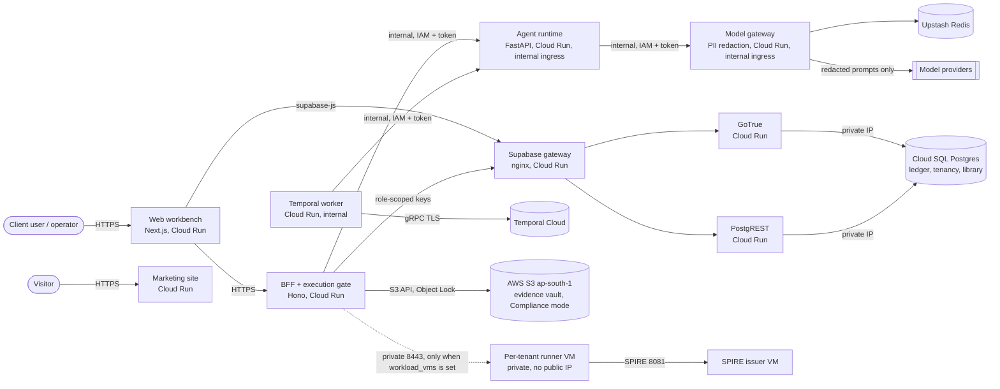
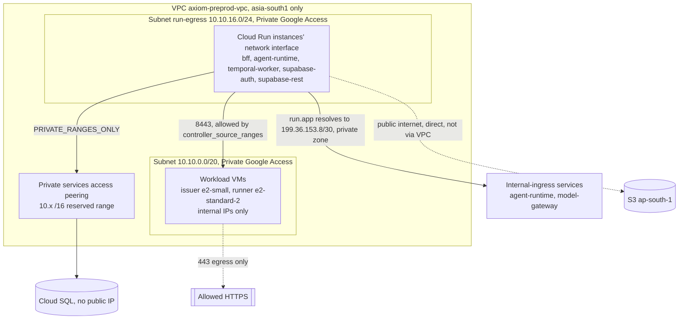
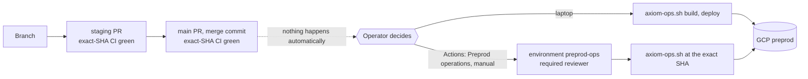

# Axiom Proof — Functional flow and technical architecture

### Axiom Minds Private Limited · https://axiomminds.ai

Replaces `LIVE_FUNCTIONAL_FLOW_GUIDE.md` and the architecture parts of
`19_Phase0-5_Extension_Samadhan_Pramaan_Architecture.md` (both now stubs).
The authoritative system architecture is
[04_Solution_Architecture.md](04_Solution_Architecture.md) (four layers,
control vs data plane, execution safety chain, ledger schema, ADRs); this
file links to it and does not repeat it. Visual map:
[10_Systems_Map.html](10_Systems_Map.html). Status of everything described
here: [20_Plan.md](20_Plan.md) section 3. Source tags: `[G]` = the
live-functional-flow guide, `[19]` = the Samadhan/Pramaan spec, `[16]` =
operator runbook, `[08]` = deployment guide.

> **Status caveat.** The flow below is the **intended** end-to-end flow. As of
> 2026-10-01 the production connector write path, the source-bound statutory
> and approval-proof stages, and any deployment are not delivered or accepted
> (see `20_Plan.md`). The staging flow script exercises local Docker/staging
> stacks, not production.

## 1. Functional flow

### 1.1 Chain of custody (12 agents; target, unaccepted) `[19]`

```
Drishti + Vibhaag  -> personal-data inventory and RoPA mapping
Parikshan          -> 46 DPDPA control findings and exposure
Sudhaar (maker)    -> remediation plan + rollbacks + dry-run (read-only, ADR-3)
Client approver    -> MFA step-up + signed, scope-bound approval token (BR-2)
Karya (doer)       -> mutating execution + pre/post state capture (token-gated)
Parikshan          -> post-execution control verification
Samadhan           -> maker-checker reconciliation, zero-drift statement
Saakshi + Lekha    -> S3 Object Lock Compliance vault + append-only ledger entry
Prativedan         -> working registers and executive drafts
Pramaan            -> source-bound closure synthesis, verifiable offline pack
Founder / DPO      -> statutory review and release gate (BR-4) -> client / regulator
```

Also: **Nazar** (regulatory watch: MeitY gazette, DPB) and **Sanket** (market
and incident signals). Roster, autonomy levels and `can_mutate` flags are in
section 2.2.

### 1.2 Walkthrough A: web workbench (interactive) `[G]`

Seeded personas exist for local/staging (founder/super-admin; a fintech DPO
`admin`; a healthcare auditor `reviewer`; a SaaS security lead `approver`).
Credentials are defined only in the seed scripts (`scripts/seed-users.ts`,
`scripts/seed-personas.ts`); they are deliberately not repeated here. A
skip-login bypass is forbidden in every environment `[G]`.

| Step                           | Where (local default `http://localhost:3001`)               | What happens                                                                                                                                                                                                                                |
| ------------------------------ | ----------------------------------------------------------- | ------------------------------------------------------------------------------------------------------------------------------------------------------------------------------------------------------------------------------------------- |
| 1 Sign in / sign up            | `/login`, `/login?mode=signup`                              | Strict auth; redirects to the workbench                                                                                                                                                                                                     |
| 2 Onboard organisation         | `/onboarding` or tenant switcher "Onboard New Organization" | Legal name, slug, tier (Growth/Enterprise), statutory flags (SDF s.10, health, children), DPO details, initial repositories; creates tenant, records `tenant.created` in the ledger, binds the account as owner, initialises the engagement |
| 3 Run discovery and assessment | `/workbench`                                                | Run Drishti, Vibhaag, Parikshan (46 controls, DPDPA v0.1.0 per guide), Sudhaar (plans with rollback)                                                                                                                                        |
| 4 Approve                      | `/approval` or `/plans`                                     | Review dry-run diff and validated rollback; "Approve Selected Actions" records rationale and issues an HMAC-SHA256 scope-bound token; Karya dispatched with the token                                                                       |
| 5 Seal and report              | `/evidence`, `/monitoring`, `/reports`, `/ledger`           | Saakshi-sealed artifacts; Nazar/Sanket surveillance; Board Executive Pack and DPB Auditor Dossier; "Verify Cryptographic Chain" on the ledger                                                                                               |

Current reality for step 4-5 (see `20_Plan.md` D10): approval requires a
completed dry-run and validated rollback in every case; historical Pramaan
dossiers are metadata only; only source-bound board and auditor paths are
open; outbound email dispatch is closed.

### 1.3 Walkthrough B: headless script `[G]`

```bash
./scripts/run-staging-flow.sh                       # Linux/macOS, local stack
./scripts/run-staging-flow.sh http://192.168.1.11:4000 http://192.168.1.11:55321 "Zenith Fiduciary Corp"
.\scripts\run-staging-flow.ps1                      # Windows 11
.\scripts\run-staging-flow.ps1 -BffUrl "http://192.168.1.11:4000" -SupabaseUrl "http://192.168.1.11:55321" -OrgName "Zenith Fiduciary Corp"
```

Runs the 13-step flow with dynamically generated account, tenant, engagement
and systems; prints per-agent status and latency (the guide lists Drishti
~40 ms, Parikshan 46 controls, Approval Console token, Karya "token-gated
simulated execution", Saakshi sealing, Nazar, Sanket, Prativedan board pack,
Ledger `intact: true`) and clickable workbench URLs. Karya execution in this
flow is simulated.

### 1.4 Continuous monitoring and regression checks `[G]`

- **Nazar**: watches MeitY gazette/DPB orders; links changes to affected
  control IDs and queues re-assessment in Parikshan.
- **Breach protocol (s.8(6))**: `/breaches` simulates the 6-hour CERT-In and
  72-hour DPB clocks with immutable ledger receipts.
- **Ledger verification** (any officer or auditor):

```bash
curl -s -X POST http://localhost:4000/v1/ledger/verify \
  -H "Authorization: Bearer <JWT>" -H "X-Tenant-Id: <TENANT_UUID>" | jq .
```

Must return `{"intact": true}`; on tampering the first break and sequence
number are reported.

## 2. Technical architecture

### 2.1 Components (monorepo; see AGENTS.md)

| Layer                | Component                                                                                                      | Notes                                                                                                                                  |
| -------------------- | -------------------------------------------------------------------------------------------------------------- | -------------------------------------------------------------------------------------------------------------------------------------- |
| Apps                 | `apps/web` (Workbench `app.axiomproof.ai`), `apps/marketing`                                                   | SSR calls the BFF; web/marketing receive no service-role key (Helm fixed in Rev 109)                                                   |
| API / execution gate | `services/bff` (Hono)                                                                                          | Approval-token issuance (dry-run + rollback required, BR-2), capability matrix, idempotency, ledger writes                             |
| Agents               | `services/agent-runtime` (FastAPI, named agents)                                                               | Executor, dry-run, rollback, verification, reconciliation, scheduler (`axiom/scheduler.py`, off unless `feature_continuous_scheduler`) |
| Model                | `services/model-gateway`                                                                                       | PII redaction before egress; self-hosted option                                                                                        |
| Orchestration        | `services/temporal-workers`                                                                                    | Opaque assessment workflow `axiom.assessment.job.v1`; v2 compliance workflow                                                           |
| Data                 | Postgres (self-hosted Supabase in higher envs), S3 Object Lock Compliance (MinIO on-prem)                      | RLS tenant-bound; ledger via SECURITY DEFINER `append_ledger()` only                                                                   |
| Shared               | `packages/{design-tokens,ui,types,control-library,ledger,evidence,approval-engine,supabase,config,report-kit}` | `@axiom/report-kit` carries branding and the offline evidence-pack verifier                                                            |

Architecture-of-record items from the runbook `[16]`:

- **Topology:** public APIs on Cloud Run; one **dedicated private Mumbai runner
  VM per tenant** and a separate private SPIRE issuer VM (Terraform module
  `infra/terraform/modules/workload-vms`, default off); user decision 2026-09-23.
- **Workload identity:** SPIFFE JWT-SVIDs for every agent workload; the
  broker's acquisition endpoint stays deny-all until W4.3/W4.4 enforcement is
  wired. One connector identity per tenant; `connector.write` only for Karya
  with a valid approval token.
- **Dispatch:** encrypted outbox (0044/0045), per-tenant KMS wrapping keys in
  `ap-south-1` / `asia-south1`, persisted dispatch policy fences (0047),
  per-job container isolation (UID 20003 worker; only the controller UID 20000
  holds the daemon socket), claims are single-use and never reset.
- **Execution:** `/internal/execute` consumes claimed batches through a
  write-adapter seam; blast-radius governor; stop-on-failure; kill switch;
  rollback in reverse order; reconciliation statement HMAC-signed with the
  approval signing key (0061-0063).
- **Discovery:** read-only SQL (PostgreSQL, MySQL) and REST/GraphQL transports
  return metadata and value-shape counts only, recorded before being returned
  (0059).
- **Proof boundary (0089):** founder review/release and proof mutations are
  callable only by the BFF through the `statutory_proof_writer` role, not by
  shared `service_role` `[A98]`. Migration 0099 (untested draft) is meant to
  extend this boundary to `append_ledger` and the execution gate; see
  `21_Progress.md` section 2.

### 2.2 Agent roster `[19]` (target; Samadhan and Pramaan not accepted as deployed)

| #   | Agent      | Function                     | Level / mutation                       |
| --- | ---------- | ---------------------------- | -------------------------------------- |
| 1   | Drishti    | Discovery                    | L1 autonomous                          |
| 2   | Vibhaag    | Classification               | L1                                     |
| 3   | Parikshan  | Assessment (46 controls)     | L1                                     |
| 4   | Sudhaar    | Planning (maker)             | L1, strictly read-only (ADR-3)         |
| 5   | Karya      | Execution (doer)             | L2 approval-gated; only mutating agent |
| 6   | Samadhan   | Maker-checker and reconciler | L1, `can_mutate=false`                 |
| 7   | Saakshi    | Evidence vault (WORM)        | L1                                     |
| 8   | Lekha      | Ledger custodian             | L1                                     |
| 9   | Prativedan | Draftsman (working docs)     | L1                                     |
| 10  | Pramaan    | Statutory closure and proof  | L1 + founder/DPO release seal          |
| 11  | Nazar      | Regulatory watch             | L1                                     |
| 12  | Sanket     | Market signals               | L1                                     |

### 2.3 Samadhan and Pramaan contracts `[19]`

**Samadhan.** Facts come from the database (`approval_tokens`,
`execution_batches`). Out-of-scope execution fails `out_of_scope_executed`;
digest recomputed at settle time, mismatch flagged `content_digest_drift`;
statement signed HMAC-SHA256 with the batch's `approval_signing_key`.
Contract (`packages/types/src/agents.ts`): input `tenant_id, plan_id, batch_id,
correlation_id`; output `verdict` in `clean | drift_detected |
partial_execution | out_of_scope`, `unexecuted_count`, `content_digest_drift`,
`statement`, `statement_signature`; tool scopes `plan.read, batch.read,
reconciliation.write, ledger.append`; escalations `out_of_scope_executed,
content_digest_drift, swept_actions_present`; phase 3.

**Pramaan.** Binds findings, plan, approver identity, execution batches,
Samadhan certificate, Saakshi manifest and Lekha ledger hash; produces a
deterministic `@axiom/report-kit` ZIP with an embedded
`verify_evidence_pack.py`; stays `draft` until the founder/DPO gate
(`release_report`, BR-4). Input `tenant_id, engagement_id, dossier_type`
(`board_executive | dpb_statutory | auditor_assurance | technical_register`),
`title`; output `dossier_id, status (draft|approved|published), merkle_root,
manifest_hash, archive_hash, proof_seal_hash, sealed_at`; tool scopes
`findings.read, plan.read, reconciliation.read, evidence.read, ledger.read,
dossier.write, pdf.render`; escalations `unreconciled_batch_present,
ledger_hash_chain_discontinuity, unsealed_evidence_member`; phase 5. **Gold
ProofSeal and any statutory attestation must not be claimed before exact
source/archive object versions and review are independently verified.**

Current implementation boundary `[A98]`: only `board_executive` has an
authoritative source contract (published board report from a finalized
assessment, its frozen request/source packet, exact retained source JSON and
PDF versions); `dpb_statutory`, `auditor_assurance`, `technical_register` and
`full_closure` return `source_bound_dossier_required`.

### 2.4 Implementation checklist for the two agents

Carried over from `[19]` roadmap; all items were unchecked in the source.
Tracked as work under W8.4/W8.5 in `20_Plan.md` section 8.

- [ ] `AgentName` enum, `AgentContract`s, three ledger action types, `plan_reconciliations.reconciled_by_agent`, table `pramaan_dossiers`, `seal_pramaan_dossier(...)`
- [ ] `samadhan.py`, `pramaan.py`, executor attribution; tests >= 90% coverage
- [ ] report-kit additions (`reconciliation_statement.json`, `ledger_chain_receipt.json`) and offline verifier extension; BFF closure/release routes
- [ ] Web: execution console Samadhan card, Reports page Prativedan/Pramaan split, sidebar entries, marketing roster of 12; Gold `ProofSeal` only on verified closure

### 2.5 Brand rules (AGENTS.md)

Indigo `#1E2A4A` trust; Teal `#0FB5A5` machine intelligence/approvals; Gold
`#C9A227` **reserved for sealed evidence and attestations only**; Ember
`#D9534F` gaps/risks; Slate/Mist neutrals.

## 3. Deployed architecture: GCP preprod (finalised design, 2026-10-03)

Nothing here is deployed yet. This is the target the Terraform in `infra/terraform/envs/preprod` and the scripts in `scripts/` build, and it is what `scripts/axiom-ops.sh deploy --env preprod` creates. Production (AWS EKS, `infra/terraform/envs/prod`) follows the same logical design and is not covered here. Source tags: `[tf]` the Terraform file named, `[ops]` runbook section 1a.

### 3.1 High-level architecture



Four rules shape the picture and must survive any change: the BFF is the only service that issues approval tokens and mutates (BR-2); the planning agent holds no write credential (ADR-3); the ledger is append-only through `append_ledger()`; evidence goes to S3 Object Lock Compliance in `ap-south-1`, never to GCS.

### 3.2 Low-level network and security design



| Concern                | Design                                                                                                                                                                                                                                                                                                                                                                                                                                                                                                                                                          |
| ---------------------- | --------------------------------------------------------------------------------------------------------------------------------------------------------------------------------------------------------------------------------------------------------------------------------------------------------------------------------------------------------------------------------------------------------------------------------------------------------------------------------------------------------------------------------------------------------------- |
| Cloud Run to Cloud SQL | **Direct VPC egress** (`vpc_access.network_interfaces`) on a dedicated `/24`, `egress = PRIVATE_RANGES_ONLY`, second-generation execution environment. No connector. Cloud SQL stays private-only unless a reviewed `/32` runner is allowed.                                                                                                                                                                                                                                                                                                                    |
| Internet egress        | Direct from Cloud Run (S3, Temporal Cloud, Upstash, model providers). `ALL_TRAFFIC` is deliberately not used: it would force a NAT gateway and a static IP for no benefit.                                                                                                                                                                                                                                                                                                                                                                                      |
| Firewall to runners    | The workload-vms module denies all ingress except issuer 8081 from runner service accounts and runner 8443 from `controller_source_ranges`. For preprod that range is the run-egress subnet `10.10.16.0/24`. Rules match ranges and service accounts, never network tags (tags are caller-editable).                                                                                                                                                                                                                                                            |
| Secrets                | Secret Manager (Mumbai), one runtime service account per service, narrow `secretAccessor` grants. No JSON keys; the manual workflow uses workload identity federation.                                                                                                                                                                                                                                                                                                                                                                                          |
| Public surface         | web, marketing, BFF and the Supabase gateway/auth/rest are public by design (JWT and RLS are the boundary). **agent-runtime and model-gateway are internal-ingress only** (decided 2026-10-03): no `allUsers` invoker, a per-caller IAM invoker (BFF and temporal-worker may call agent-runtime; only agent-runtime may call model-gateway), a Google ID token in `X-Serverless-Authorization` on every call, and the shared token header kept as a second check. temporal-worker is internal-only. `internal_services_private = false` is the rollback switch. |
| Data residency         | Cloud SQL, Cloud Run, VMs, Secret Manager, Artifact Registry in `asia-south1`; evidence in S3 `ap-south-1`; the model gateway redacts PII before any egress.                                                                                                                                                                                                                                                                                                                                                                                                    |

### 3.3 Component map

| Component             | Runs as                                     | Defined in `[tf]` / code                                  | Talks to                                                                                  | Scaling today (preprod)                     |
| --------------------- | ------------------------------------------- | --------------------------------------------------------- | ----------------------------------------------------------------------------------------- | ------------------------------------------- |
| Web workbench         | Cloud Run `axiom-web-preprod`               | `cloudrun.tf`, `apps/web`                                 | BFF, Supabase gateway                                                                     | min 0 (parameter), max 2                    |
| Marketing site        | Cloud Run `axiom-marketing-preprod`         | `cloudrun.tf`, `apps/marketing`                           | none (static content, forms via BFF; a Firebase Hosting copy is an optional deploy phase) | min 0, max 2                                |
| BFF / execution gate  | Cloud Run `axiom-bff-preprod`               | `cloudrun.tf`, `services/bff`                             | agent runtime, model gateway, Supabase, S3, runners                                       | min 0 (parameter), max 2; Direct VPC egress |
| Agent runtime         | Cloud Run `axiom-agent-runtime-preprod`     | `cloudrun.tf`, `services/agent-runtime`                   | model gateway, Supabase                                                                   | min 0 (parameter), max 2; Direct VPC egress |
| Model gateway         | Cloud Run `axiom-model-gateway-preprod`     | `cloudrun.tf`, `services/model-gateway`                   | model providers (redacted), Redis                                                         | min 0, max 2                                |
| Temporal worker       | Cloud Run `axiom-temporal-worker-preprod`   | `cloudrun.tf`, `services/temporal-workers`                | Temporal Cloud, agent runtime                                                             | min 0, max 2, internal ingress              |
| Supabase gateway      | Cloud Run `axiom-supabase-preprod`          | `supabase.tf`                                             | GoTrue, PostgREST                                                                         | min 0 (parameter), max 2                    |
| GoTrue (auth)         | Cloud Run `axiom-supabase-auth-preprod`     | `supabase.tf`                                             | Cloud SQL (private IP)                                                                    | min 0 (parameter), max 2; Direct VPC egress |
| PostgREST (data API)  | Cloud Run `axiom-supabase-rest-preprod`     | `supabase.tf`                                             | Cloud SQL (private IP)                                                                    | min 0 (parameter), max 3; Direct VPC egress |
| Database              | Cloud SQL Postgres, private IP              | `cloudsql.tf`, `infra/supabase/migrations`                | n/a                                                                                       | one zonal instance                          |
| Evidence vault        | AWS S3 `ap-south-1`, Object Lock Compliance | operator-owned; `scripts/verify-preprod-s3.py` gates      | written by BFF                                                                            | n/a                                         |
| Issuer and runner VMs | Compute Engine, private only                | `modules/workload-vms`, off unless `workload_vms` set     | SPIRE 8081, controller 8443                                                               | one issuer, one runner/tenant               |
| Images                | Artifact Registry `axiom-proof-preprod`     | `artifact_registry.tf`, `scripts/build-preprod-images.sh` | n/a                                                                                       | keeps the 10 most recent                    |
| Secrets               | Secret Manager                              | `secrets.tf`, `iam.tf`                                    | read by service accounts                                                                  | n/a                                         |

### 3.4 Flows

**Interactive approval and execution (BR-2).** The user signs in through the gateway (GoTrue issues the JWT). The web app calls the BFF. The BFF asks the agent runtime for a plan; Sudhaar produces it read-only with a dry-run and a validated rollback. The approver completes MFA step-up; the BFF issues a signed, scope-bound approval token only if the dry-run and rollback exist. The execution agent presents the token; the BFF validates it per action, writes the ledger entry through `append_ledger()`, and seals the evidence to S3 Object Lock. No path skips the token.

**Release and deploy (operator-triggered only).**



A deploy runs the phases `prep, base, db, images, services, migrate, firebase, verify`, builds nine images tagged `release-<exact SHA>`, applies Terraform against a remote regional state bucket, runs the checksummed migrations, then the live readback and acceptance checks. It refuses a dirty tree, any region but `asia-south1`, and a tag that is not the exact HEAD SHA.

**Soft stop and start (non-production, nothing deleted).** `stop`: Cloud Run minimum instances to 0 (old value in a label), then labelled VMs stopped, then Cloud SQL activation policy NEVER. `start`: Cloud SQL ALWAYS and wait for RUNNABLE, then VMs, then Cloud Run restored. The database is last down and first up because every other tier depends on it. `--env all` walks every non-production environment that has an env file.

### 3.5 What changed in this design (Direct VPC egress) and why

The Serverless VPC Access connector (two always-on `e2-micro` instances, billed whether or not traffic flows, sized by hand with a throughput cap) was replaced by Direct VPC egress. Google recommends it over connectors: lower latency and higher throughput on a direct network path, no connector instances to size, patch or watch, and no compute charge, only network egress at the same rate. In this repo it also removes the one network object that could not be soft-stopped. Sources: [Direct VPC egress](https://docs.cloud.google.com/run/docs/configuring/vpc-direct-vpc), [migrating from a connector](https://docs.cloud.google.com/run/docs/configuring/migrate-direct-vpc).

Costs and constraints to know (not blockers):

- It needs a subnet of at least `/26`; this design uses a `/24` because Cloud Run reserves addresses in blocks of 16 per service, uses about twice the instance count at steady state, and keeps a retired revision's addresses for up to 20 minutes.
- That 20-minute hold means the egress subnet cannot be deleted right after its services; the teardown script destroys it in the final network phase.
- Source addresses now come from the egress subnet, so `controller_source_ranges` for runner firewalls must be `10.10.16.0/24` (the example tfvars say so).
- It needs the second-generation execution environment (set explicitly), which has a slightly slower cold start than the first.
- Verified offline only: Terraform `validate`, `fmt` and 15 mocked-provider tests (three of them new, each mutation-checked). **Never planned or applied against a real project.**

### 3.6 Decisions taken (2026-10-03) and what is still open

| #   | Decision                                                                                                                                    | Where it lives                                                                                                                                                 |
| --- | ------------------------------------------------------------------------------------------------------------------------------------------- | -------------------------------------------------------------------------------------------------------------------------------------------------------------- |
| D1  | Non-production does not keep instances warm. Every always-on preprod service scales to zero; startup CPU boost is on to soften cold starts. | Terraform variable `min_instance_count` (default 0, range 0-2), env key `AXIOM_RUN_MIN_INSTANCES`. Set 1 to keep one warm.                                     |
| D2  | A nightly soft stop is on offer, opt-in. It can only stop, never deploy, build or start, and deletes nothing.                               | `.github/workflows/preprod-nightly-stop.yml`; repository variable `NIGHTLY_STOP_ENABLED=true` turns it on; cron `30 16 * * *` UTC (22:00 IST); edit to change. |
| D3  | agent-runtime and model-gateway are internal by design: internal ingress, per-caller IAM, ID tokens, private DNS routing.                   | Terraform `internal_services_private` (default true), `iam.tf`, `main.tf`; code: service-auth helpers in the BFF, temporal-workers and agent-runtime.          |
| D4  | Edge protection (WAF) is not needed in non-production. For production it is optional, parameterised, and creates nothing unless enabled.    | Production Terraform variable `enable_edge_protection` (default false), env key `AXIOM_ENABLE_EDGE_PROTECTION`, module `infra/terraform/modules/edge-waf`.     |

Things to know about these:

- **D3 is unproven in a real project.** The helper code and Terraform are tested offline only. The routing relies on the private `run.app` DNS zone plus Private Google Access; the first deploy must show one successful BFF to agent-runtime call and one agent-runtime to model-gateway call. If routing misbehaves, set `AXIOM_INTERNAL_SERVICES_PRIVATE=false` and redeploy; that restores the public endpoints guarded by the shared token (the earlier design). A failed token fetch fails the call closed, never unauthenticated.
- **Why D3 was not already in place:** the Terraform left these two public with only the shared token header as protection (its own comment says so) and I found no recorded reason beyond that. It was a gap against the intended design, and closing it now, before anything is deployed, avoids a live cutover later.
- **Kubernetes production already has the right shape:** agent-runtime and model-gateway are `ClusterIP` services behind NetworkPolicies there, so D3 closes the gap only for the GCP preprod rehearsal.
- **D4 caveat.** A WAF ACL takes effect only when attached to an Application Load Balancer or a CloudFront distribution. Production ingress today is nginx behind an NLB, which WAF cannot protect, so enabling the flag alone changes nothing at runtime. Switching the edge to ALB or CloudFront is a production design decision, still open.
- **Smaller changes made with these:** every service now has startup CPU boost; the BFF keeps its VPC path because it calls agent-runtime through it (the earlier idea of dropping it, O1, no longer applies); the `dns.googleapis.com` API is enabled by the deploy script.

Still open, not decided: the production edge (ALB or CloudFront plus WAF), and whether the preprod acceptance workflow should be taught to probe the now-internal services from inside the VPC (today it exercises them through the BFF only).
