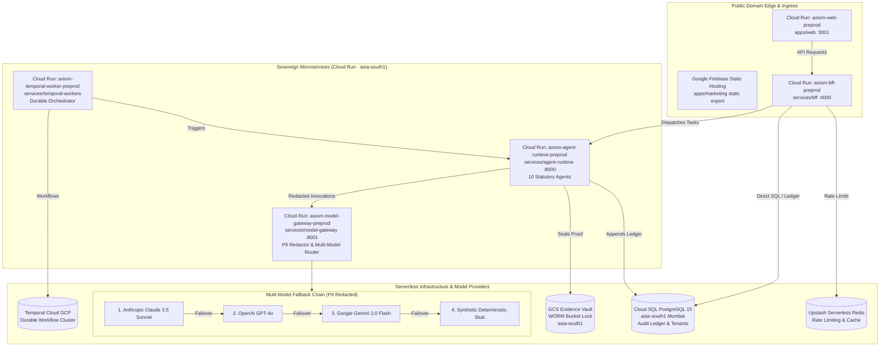

# Axiom Proof — Google Cloud Platform Preprod Deployment & Runbook

**Environment:** Preproduction (`preprod`)  
**Target Cloud:** Google Cloud Platform (GCP)  
**Primary Region:** Mumbai (`asia-south1`) — 100% Domestic Indian Data Residency  
**Architecture Tagline:** _"Agents do the work. You approve. The proof is automatic."_

---

## 1. Architectural Topology & Component Mapping

The preproduction deployment decomposes Axiom Proof into independent, horizontally-scalable containers deployed on **Cloud Run**, backed by **Cloud SQL PostgreSQL**, a **GCS WORM Evidence Vault**, **Google Firebase Static Hosting** for marketing, **Upstash Redis** for distributed rate limits, **Temporal Cloud** on GCP for durable orchestration, and a **redacting Model Gateway** executing a multi-model fallback chain (**Anthropic → OpenAI → Gemini**).



### Component Inventory & Resource Allocations

| Component                   | Repository Path             | Deploy Platform      |  Port  | Sizing (Preprod)     |  Scaling Bounds  |
| :-------------------------- | :-------------------------- | :------------------- | :----: | :------------------- | :--------------: |
| **API Layer (BFF)**         | `services/bff`              | Cloud Run v2         | `4000` | 2 vCPU / 2 GiB RAM   | 1 – 10 instances |
| **App Layer (Workbench)**   | `apps/web`                  | Cloud Run v2         | `3001` | 2 vCPU / 2 GiB RAM   | 1 – 10 instances |
| **Agents Layer (Runtime)**  | `services/agent-runtime`    | Cloud Run v2         | `8000` | 2 vCPU / 4 GiB RAM   | 1 – 5 instances  |
| **Model Gateway**           | `services/model-gateway`    | Cloud Run v2         | `8001` | 2 vCPU / 4 GiB RAM   | 1 – 5 instances  |
| **Temporal Worker**         | `services/temporal-workers` | Cloud Run v2         |   —    | 1 vCPU / 2 GiB RAM   | 1 – 3 instances  |
| **Marketing (Container)**   | `apps/marketing`            | Cloud Run v2         | `3000` | 1 vCPU / 1 GiB RAM   | 1 – 5 instances  |
| **Marketing (Public Site)** | `apps/marketing/out`        | Firebase Static      |   —    | CDN Edge Cached      | Global CDN Edge  |
| **Database**                | `infra/supabase/migrations` | Cloud SQL PG 15      | `5432` | `db-custom-2-7680`   | Auto-resize SSD  |
| **Evidence Vault**          | `packages/evidence`         | Google Cloud Storage |   —    | Standard / WORM Lock |    Unlimited     |
| **Cache & Queue**           | Upstash Redis               | Serverless Upstash   | `6379` | Serverless Redis     |    Auto-scale    |
| **Orchestration**           | Temporal Cloud              | GCP Subscription     | `7233` | Managed Cloud        |    SLA 99.99%    |

### Independent Docker Topology for Scalability & Local Parity

To maximize horizontal scalability, failure isolation, and independent rollouts, Cloud Run executes different Docker containers for each microservice layer. When running locally (or testing preprod on localhost), the exact same architecture runs across 9 distinct Docker containers:

| Service              | Container Name           | Localhost URL            | Purpose & Scalability Role                                                                     |
| :------------------- | :----------------------- | :----------------------- | :--------------------------------------------------------------------------------------------- |
| **Web Workbench**    | `axiom-web`              | `http://localhost:3001`  | Core operator UI, plan review, approval console, kill switch (Scales 1–10 on Cloud Run)        |
| **Marketing Site**   | `axiom-marketing`        | `http://localhost:3000`  | Public funnel & interactive 5-minute DPDPA gap-scan (Scales 1–5 on Cloud Run, or Firebase CDN) |
| **BFF API Engine**   | `axiom-bff`              | `http://localhost:4000`  | Execution gate, auth, approval token issuance, kill switch (Scales 1–10 on Cloud Run)          |
| **Agent Runtime**    | `axiom-agent-runtime`    | `http://localhost:8000`  | 10 named compliance agents: Drishti, Sudhaar, etc. (Scales 1–5 on Cloud Run)                   |
| **Model Gateway**    | `axiom-model-gateway`    | `http://localhost:8001`  | PII redactor (Presidio + regex) & LLM router (Scales 1–5 on Cloud Run)                         |
| **Temporal UI**      | `axiom-temporal-ui`      | `http://localhost:8233`  | Durable workflow state machine visualizer                                                      |
| **Temporal Server**  | `axiom-temporal`         | `localhost:7233`         | gRPC orchestration engine                                                                      |
| **Supabase Studio**  | `axiom-supabase-studio`  | `http://localhost:55323` | Database inspection, tables, and SQL editor                                                    |
| **Supabase Gateway** | `axiom-supabase-gateway` | `http://localhost:55321` | Kong API gateway & Supabase REST                                                               |

---

### Self-hosted Supabase, and why the order matters

Preprod does not use Supabase Cloud. GoTrue and PostgREST run as Cloud Run services against this environment's own Cloud SQL, so preprod is a real replica of production and no third-party processor sits in the data path. An nginx gateway presents both on one origin, because `supabase-js` is given a single base URL and appends `/auth/v1` and `/rest/v1` itself.

```
   SUPABASE_URL ──▶ axiom-supabase-preprod (nginx)
                        ├── /auth/v1/ ──▶ axiom-supabase-auth-preprod (GoTrue)
                        └── /rest/v1/ ──▶ axiom-supabase-rest-preprod (PostgREST)
                                                    │
                                              Cloud SQL
```

The deployment sequence is load-bearing, and every way of getting it wrong fails in a message that points somewhere else:

| Order | Step                                                                                                                                          | What happens if it moves                                                                                                                                        |
| ----- | --------------------------------------------------------------------------------------------------------------------------------------------- | --------------------------------------------------------------------------------------------------------------------------------------------------------------- |
| 1     | `infra/supabase/bootstrap-selfhosted.sql` — roles, an **empty** `auth` schema, and the `storage` table contract migration 0007 writes against | GoTrue exits with `schema "auth" does not exist`. It never creates the schema, only the tables in it.                                                           |
| 2     | GoTrue starts and applies its own 54 migrations, owning `auth`                                                                                | If the migration series ran first, migration 0000's hand-rolled `auth.users` is already there, and GoTrue's chain breaks partway having created sixteen tables. |
| 3     | The migration series, over GoTrue's schema. 0000's auth tables become no-ops                                                                  | —                                                                                                                                                               |
| 4     | PostgREST starts                                                                                                                              | —                                                                                                                                                               |

Two settings are not optional and neither announces itself:

- **`search_path=auth` on GoTrue's connection.** Its MFA migration creates the `factor_type` and `factor_status` enums _unqualified_. Without it they are created in `public`, and a later migration dies on `type "auth.factor_type" does not exist` — after sixteen tables already exist, so it reads like a schema conflict rather than a `search_path` one. Terraform carries this in a dedicated `gotrue_db_url` secret.
- **`GOTRUE_JWT_DEFAULT_GROUP_NAME=authenticated`.** Unset, GoTrue emits an empty `role` claim, PostgREST runs `set local role ""`, and every authenticated request fails with `role "" does not exist` — a 400 that looks like a malformed query.

All of this is pinned by `tests/deployment/selfhosted-supabase.sh`, which builds the deployed shape against real GoTrue and PostgREST on every CI run and asserts that a sign-up produces a token PostgREST accepts and that RLS answers it as itself.

> [!IMPORTANT]
> Supabase **Storage** is not deployed. The bootstrap creates `storage.buckets` and `storage.objects` so migration 0007 can apply, but nothing serves those buckets until `supabase/storage-api` is added. The evidence vault is unaffected: it writes to GCS through the S3 API and never touches Supabase Storage.

## 2. Prerequisites & Pre-flight Setup

Ensure your administrative workstation or deployment bastion has the following tools installed:

```bash
# Verify CLI installations
gcloud --version        # Google Cloud SDK (>= 470.0.0)
terraform version       # HashiCorp Terraform (>= 1.5.0)
docker --version         # Docker Engine / Desktop with Compose v2
pnpm --version           # PNPM (>= 9.12.0)
node --version           # Node.js (>= 20.11.0, recommended 22 LTS)
uv --version             # Astral uv Python package installer
firebase --version       # Firebase CLI (or run via npx)
jq --version             # Command-line JSON processor
```

### Initializing GCP Project & Identity

```bash
export GCP_PROJECT_ID="axiom-proof"
export GCP_REGION="asia-south1"

# 1. Login to Google Cloud
gcloud auth login
gcloud config set project "${GCP_PROJECT_ID}"

# 2. Configure Application Default Credentials
gcloud auth application-default login

# 3. Enable Required Google Cloud APIs
gcloud services enable \
  run.googleapis.com \
  sqladmin.googleapis.com \
  storage.googleapis.com \
  secretmanager.googleapis.com \
  artifactregistry.googleapis.com \
  vpcaccess.googleapis.com \
  compute.googleapis.com \
  servicenetworking.googleapis.com
```

---

## 3. Step-by-Step Terraform Provisioning

The Terraform configuration at `infra/terraform/envs/preprod` establishes the entire regional infrastructure in `asia-south1`.

### Step 3.1: Configure the environment

Terraform variables are **generated**, not hand-written. `infra/docker/environments/.env.preprod` is the single source of truth for every environment value, and `scripts/sync-env.sh` propagates it to `terraform.tfvars`, Secret Manager and Cloud Run.

Editing `terraform.tfvars` directly no longer has any effect — the next `sync-env.sh preprod terraform` overwrites it, and the deploy pipeline runs that on every invocation.

```bash
# 1. Create .env.preprod, or bring an existing one up to the template.
#    Only missing keys are appended; values you have already set are kept.
./scripts/sync-env.sh preprod scaffold

# 2. Generate the secrets that must be generated. This fills the Supabase
#    JWT secret and its anon/service keys FROM ONE MINTING — those two keys
#    are JWTs signed with that secret, and mixing values from separate runs
#    leaves GoTrue issuing tokens PostgREST rejects.
./scripts/sync-env.sh preprod mint

# 3. Fill in everything a machine cannot generate: the GCP project, the
#    provider API keys, the Temporal namespace, the Upstash URL.
$EDITOR infra/docker/environments/.env.preprod

# 4. Confirm it is complete. This is a gate, not a report: missing or
#    placeholder values exit non-zero and the deploy refuses to start.
./scripts/sync-env.sh preprod verify
```

Two values deserve a conscious decision rather than a default:

| Key                             | Why it matters                                                                                                                                                                                                                                                                                               |
| ------------------------------- | ------------------------------------------------------------------------------------------------------------------------------------------------------------------------------------------------------------------------------------------------------------------------------------------------------------ |
| `AXIOM_EVIDENCE_RETENTION_DAYS` | Applied as a COMPLIANCE-mode Object Lock, which **nobody — including the project owner — can shorten or delete** before it expires. The DPDPA statutory term Axiom Proof reports against is 2555 days; preprod deliberately uses a short value so a test bucket does not become undeletable for seven years. |
| `AXIOM_TRUSTED_PROXY_HOPS`      | How many proxies sit in front of the BFF. `0` disables address-scoped MFA budgets rather than trusting a caller-supplied `x-forwarded-for`, which would let an attacker exhaust a victim's quota.                                                                                                            |

> [!NOTE]
> A Terraform variable that nothing fills from `.env` is a build failure, enforced by `scripts/check-tfvars-coverage.sh` in CI. This exists because the variable mapping used to be hand-written in the deploy script and covered 15 of 23: `mfa_encryption_key` among them, so an operator's configured MFA key was silently ignored while Terraform minted a different one into Secret Manager.

### Step 3.2: Initialize & Apply Infrastructure

```bash
terraform init -upgrade
terraform plan -out=preprod.tfplan
terraform apply preprod.tfplan
```

> [!TIP]
> **Self-Healing State & Existing Secret Resolution (Avoiding 409 Conflict)**:
> If any Secret Manager secret (e.g., `axiom-preprod-resend-api-key`) was previously created outside Terraform (e.g. via `gcloud` or `./scripts/sync-env.sh secrets`), running `terraform apply` directly would attempt to re-create it and fail with HTTP 409 Conflict.
> The automated pipeline (`./scripts/deploy-preprod-gcp.sh`) includes a self-healing resolver (`heal_secret_manager_state_if_needed`) that detects existing secrets in GCP and automatically imports them into state before applying. If running Terraform manually, import the pre-existing secret:
>
> ```bash
> terraform import 'google_secret_manager_secret.secret["resend_api_key"]' projects/<PROJECT_ID>/secrets/axiom-preprod-resend-api-key
> ```

### Step 3.3: Capture Terraform Outputs

```bash
export CLOUD_SQL_IP=$(terraform output -raw cloud_sql_public_ip)
export EVIDENCE_BUCKET=$(terraform output -raw evidence_vault_bucket)
export ARTIFACT_REPO=$(terraform output -raw artifact_registry_repo)
export BFF_URL=$(terraform output -raw bff_url)
export WEB_URL=$(terraform output -raw web_url)
export DB_PASSWORD=$(terraform output -raw db_password)
export GCS_S3_ENDPOINT=$(terraform output -raw gcs_s3_endpoint)
export GCS_HMAC_ACCESS_ID=$(terraform output -raw gcs_hmac_access_id)
cd -
```

### Step 3.4: Google Cloud Storage as S3 WORM Storage Architecture

To satisfy **Hard Rule 4** and statutory DPDPA auditability requirements (Section 8(4) and Rule 10 retention mandates), the Evidence Vault utilizes **Google Cloud Storage with WORM (Write Once, Read Many) Bucket Lock**, exposed via the S3-compatible XML API:

```
┌─────────────────────────────────────────────────────────────────────────┐
│                      Axiom Proof Evidence Vault                         │
│             Google Cloud Storage in Mumbai (asia-south1)                │
└─────────────────────────────────────────────────────────────────────────┘
        │                                                  │
        │ S3 XML API: https://storage.googleapis.com       │ HMAC Credentials
        │ (Standard S3Client in TS / boto3 in Python)      │ (GOOG... Access ID & Secret)
        ▼                                                  ▼
┌─────────────────────────────────────────────────────────────────────────┐
│              GCS Bucket: axiom-proof-evidence-preprod-*                 │
│  ├─ Location: asia-south1 (Domestic Indian Residency)                   │
│  ├─ Uniform Bucket-Level Access: Enforced                              │
│  ├─ Versioning: Enabled                                                 │
│  ├─ Object Retention Lock: Enabled (enable_object_retention = true)      │
│  ├─ Bucket Lock (WORM): Retention Period = 7 Years (2555 Days)          │
│  └─ Storage Lifecycle: Transitions to ARCHIVE after retention period    │
└─────────────────────────────────────────────────────────────────────────┘
```

#### Key Guarantees & Implementation:

1. **Cryptographic WORM Immutability**:
   - GCS Bucket Lock retention policy guarantees that once an evidence object is written (keyed by `sha256(content)`), it cannot be modified, overwritten, or deleted by any principal (including project owners, administrators, or service accounts) during the retention window.
2. **S3 Interoperability XML API**:
   - Cloud Run microservices connect to `https://storage.googleapis.com` using standard AWS S3 client libraries (`@aws-sdk/client-s3` in TypeScript, `boto3` in Python).
   - Authentication is backed by a dedicated GCP Service Account (`axiom-preprod-storage-sa`) with a generated HMAC key pair (`google_storage_hmac_key`).
   - HMAC credentials are automatically deposited into Google Secret Manager and mounted into `axiom-bff` and `axiom-agent-runtime`.
3. **Multi-Cloud Client Layer (`@axiom/evidence` & `axiom.evidence_client`)**:
   - When `AXIOM_STORAGE_ENDPOINT` (or legacy `S3_ENDPOINT`) points to `storage.googleapis.com`, the runtime automatically targets GCS S3 interoperability.
   - Immutability is enforced natively by the GCS bucket retention lock without sending unsupported AWS-specific request headers (`x-amz-object-lock-*`), providing seamless portability between AWS S3 Object Lock and Google Cloud Storage Bucket Lock.

### Step 3.5: Managing Evidence Storage Credentials (`AXIOM_STORAGE_ACCESS_KEY_ID` & `AXIOM_STORAGE_SECRET_ACCESS_KEY`)

The Evidence Vault client (`@axiom/evidence` and `axiom.evidence_client`) connects to the GCS S3-compatible XML API via an HMAC key pair assigned to the `axiom-preprod-storage-sa` Service Account.

#### How to GET the Values

1. **Directly from Terraform Outputs (Recommended)**:
   The preprod Terraform configuration automatically provisions the HMAC key pair and outputs both identifiers:

   ```bash
   cd infra/terraform/envs/preprod

   # Retrieve the Access Key ID (GOOG1E...)
   terraform output -raw gcs_hmac_access_id

   # Retrieve the Secret Key (sensitive output)
   terraform output -raw gcs_hmac_secret
   ```

2. **From Google Secret Manager**:
   Terraform automatically deposits these into Secret Manager:

   ```bash
   # Retrieve Access Key ID
   gcloud secrets versions access latest --secret="axiom-preprod-gcs-hmac-access-key" --project="axiom-proof"

   # Retrieve Secret Access Key
   gcloud secrets versions access latest --secret="axiom-preprod-gcs-hmac-secret-key" --project="axiom-proof"
   ```

3. **Using `gcloud storage hmac` CLI**:
   ```bash
   # List active HMAC keys for the storage service account
   gcloud storage hmac list \
     --service-account=axiom-preprod-storage-sa@axiom-proof.iam.gserviceaccount.com \
     --project=axiom-proof

   # Generate a new HMAC key pair (Secret is only displayed once upon creation):
   gcloud storage hmac create \
     axiom-preprod-storage-sa@axiom-proof.iam.gserviceaccount.com \
     --project=axiom-proof
   ```

#### How to UPDATE the Values

1. **In Local `.env.preprod` (for local CLI / migration / test runs targeting preprod)**:
   Update `.env.preprod` with the retrieved values:

   ```dotenv
   AXIOM_STORAGE_ENDPOINT=https://storage.googleapis.com
   AXIOM_STORAGE_ACCESS_KEY_ID=<value from terraform output -raw gcs_hmac_access_id>
   AXIOM_STORAGE_SECRET_ACCESS_KEY=<value from terraform output -raw gcs_hmac_secret>
   ```

2. **In Cloud Run Deployments (Zero Manual Action Required)**:
   Cloud Run services (`bff`, `agent_runtime`, `model_gateway`) automatically mount these variables directly from Google Secret Manager (`cloudrun.tf` mounts `axiom-preprod-gcs-hmac-access-key` and `axiom-preprod-gcs-hmac-secret-key`). When Terraform applies, Cloud Run resolves the latest secret version dynamically.

3. **Rotating the HMAC Key**:
   To rotate the HMAC credentials safely:
   ```bash
   cd infra/terraform/envs/preprod

   # Taint the existing HMAC key to trigger generation of a new one
   terraform taint google_storage_hmac_key.s3_compat_key

   # Apply to recreate key and update Secret Manager versions
   terraform apply -target=google_storage_hmac_key.s3_compat_key \
                   -target=google_secret_manager_secret_version.version[\"gcs_hmac_access_key\"] \
                   -target=google_secret_manager_secret_version.version[\"gcs_hmac_secret_key\"]
   ```

---

## 4. Cloud SQL PostgreSQL Database Migrations & Seeding

Cloud SQL requires bootstrap initialization to configure roles (`anon`, `authenticated`, `service_role`, `ledger_writer`) and cryptographic extensions (`pgcrypto`, `uuid-ossp`) before applying the 7 sequential migrations.

```bash
export DATABASE_URL="postgresql://axiom_admin:${DB_PASSWORD}@${CLOUD_SQL_IP}:5432/axiom_proof_preprod"

# Execute all migrations and control library seed
./scripts/migrate-cloudsql.sh "${DATABASE_URL}"
```

This applies:

1. `0000_bootstrap_roles_and_extensions.sql` (Sovereign roles & pgcrypto)
2. `0001_init_tenants_users.sql` (Multi-tenant foundation, users, engagements)
3. `0002_control_library.sql` (Statutory control library schemas)
4. `0003_assessments_findings.sql` (Parikshan findings & risk scoring)
5. `0004_remediation_actions.sql` (Sudhaar blueprints & rollbacks)
6. `0005_approvals_ledger.sql` (Cryptographic append-only audit ledger)
7. `0006_ledger_role_and_extras.sql` (Security definer `append_ledger()`)
8. `0007_storage_buckets_and_policies.sql` (Storage schemas)
9. Statutory seed of all 46 DPDPA controls (`pnpm seed:controls`).
10. Standard authenticated user & tenant provisioning (`infra/supabase/seed-users.sql` and `pnpm seed:users`).

### Standard Authenticated User Roster

Axiom Proof strictly forbids authentication bypasses or mock sessions in live environments. Login requires genuine credentials provisioned via the seed pipeline:

| Role / Persona              | Email                    | Password            | Tenant / Scope                                   |
| :-------------------------- | :----------------------- | :------------------ | :----------------------------------------------- |
| **Founder / Super Admin**   | `founder@axiomminds.ai`  | `Admin@12345678`    | All Tenants · Role: `owner` (Full scope `{"*"}`) |
| **Fintech Compliance DPO**  | `dpo@meridianpay.com`    | `Meridian@123456`   | Meridian Pay (`...0001`) · Role: `admin`         |
| **Healthcare Lead Auditor** | `auditor@aarogya.in`     | `Aarogya@123456`    | Aarogya Health (`...0002`) · Role: `reviewer`    |
| **SaaS SecOps Lead**        | `security@streamline.io` | `Streamline@123456` | Streamline SaaS (`...0003`) · Role: `approver`   |

To re-seed or verify users programmatically:

```bash
pnpm seed:users
```

---

## 5. Building & Pushing Container Images to Google Artifact Registry

All 6 microservices utilize multi-stage Docker builds for minimal container sizes and fast startup times on Cloud Run:

```bash
# Authenticate Docker with Google Artifact Registry in Mumbai
gcloud auth configure-docker "${GCP_REGION}-docker.pkg.dev" --quiet

# Build and push all 6 images
PUSH_IMAGES=true ./scripts/build-preprod-images.sh "${GCP_PROJECT_ID}" "${GCP_REGION}" "preprod"
```

Images built and pushed:

- `asia-south1-docker.pkg.dev/axiom-proof/axiom-proof-preprod/axiom-bff:preprod`
- `asia-south1-docker.pkg.dev/axiom-proof/axiom-proof-preprod/axiom-web:preprod`
- `asia-south1-docker.pkg.dev/axiom-proof/axiom-proof-preprod/axiom-agent-runtime:preprod`
- `asia-south1-docker.pkg.dev/axiom-proof/axiom-proof-preprod/axiom-model-gateway:preprod`
- `asia-south1-docker.pkg.dev/axiom-proof/axiom-proof-preprod/axiom-temporal-worker:preprod`
- `asia-south1-docker.pkg.dev/axiom-proof/axiom-proof-preprod/axiom-marketing:preprod`

---

## 6. Deploying Public Marketing Site to Google Firebase Static Hosting

The public-facing marketing site (`apps/marketing`) is deployed to **Google Firebase Static Hosting** integrated directly with GCP project `axiom-proof` for global CDN edge delivery with zero compute costs and sub-50ms TTFB.

### Firebase Project Integration with GCP

Firebase is enabled directly on the existing GCP project `axiom-proof`:

```bash
# Integrate Firebase into the GCP project (if not already enabled in console)
firebase projects:addfirebase axiom-proof
```

```bash
# 1. Login to Firebase CLI
firebase login

# 2. Build static export and deploy to Firebase site: axiom-proof
./scripts/deploy-firebase-marketing.sh "${GCP_PROJECT_ID}"
```

Under the hood, this executes:

- `NEXT_OUTPUT=export pnpm --filter @axiom/marketing build:export`
- Exports 12 pre-rendered pages to `apps/marketing/out`
- Deploys static assets, security headers (`X-Frame-Options: DENY`, `X-Content-Type-Options: nosniff`), clean URLs, and SSL certificates to `https://axiom-proof.web.app` and `https://axiom-proof.firebaseapp.com`.

---

## 7. Multi-Model Fallback Chain for Statutory Agents

Axiom Proof enforces statutory separation between compute and LLM intelligence. Raw prompt values NEVER leave the sovereign boundary unredacted.

### Fallback Hierarchy & Egress Invariant

```
Prompt -> Presidio PII Redactor (Aadhaar, PAN, Phone, Email scrubbed)
       -> 1. Anthropic (Claude 3.5 Sonnet / Haiku via ANTHROPIC_API_KEY)
            ↓ (On rate-limit / timeout / 5xx)
       -> 2. OpenAI (GPT-4o / GPT-4o-mini via OPENAI_API_KEY)
            ↓ (On secondary error / quota exhaustion)
       -> 3. Google Gemini (Gemini 2.0 Flash / 1.5 Pro via GEMINI_API_KEY)
            ↓ (Offline / test resilience)
       -> 4. Deterministic Synthetic Stub (Preserves Zero Downtime)
```

### Self-Hosted Model Gateway Roadmap (Phase 2+)

In later phases, self-hosted open-weights models (e.g. `Qwen/Qwen2.5-32B-Instruct-AWQ`) will be hosted on GKE GPU nodes (`g2-standard-8` with NVIDIA L4 GPUs) in `asia-south1`. The Model Gateway configuration already supports switching to self-hosted compute simply by setting `SELF_HOSTED_BASE_URL=http://vllm-service:8000/v1`.

---

## 8. Executing the 100% Non-Hardcoded Live Functional Flow

To verify that the preprod environment is completely functional without any hardcoded data, execute the automated end-to-end dynamic functional flow runner:

```bash
./scripts/run-preprod-flow.sh "${BFF_URL}"
```

### The 14-Step Statutory Verification Lifecycle

1. **Dynamic User Creation**: Dynamically generates unique random timestamp and credentials, creating a Compliance Officer account in the database.
2. **JWT Authentication**: Exchanges user credentials for a valid JWT access token.
3. **Organization Onboarding**: Dynamically onboards a fresh organization (e.g., `Bharat FinTech Sovereign 4821`) and registers 2 data stores in `asia-south1` (Cloud SQL PG ledger + GCS KYC vault).
4. **Drishti Discovery**: Scans systems for personal data, verifying that all repositories reside within the `asia-south1` domestic boundary.
5. **Vibhaag Categorization**: Classifies ingested fields into the 9 statutory DPDPA categories.
6. **Parikshan Assessment**: Evaluates the organization across all 46 controls, computing the baseline posture score.
7. **Sudhaar Blueprinting**: Generates an actionable remediation blueprint with explicit blast-radius calculations and rollback snapshots (enforcing `can_mutate = false`).
8. **Human Approval Gate (BR-2)**: Simulates the compliance officer review, verifies dry-run simulation results and validated snapshot rollbacks, and issues an HMAC-SHA256 scope-bound approval token.
9. **Karya Execution**: Token-gated mutating engine validates the cryptographic token signature and executes approved remediations.
10. **Saakshi Sealing**: Cryptographically seals compliance evidence into the GCS Evidence Vault (WORM Compliance mode) and computes canonical SHA-256 hashes.
11. **Nazar Watchdog**: Scans MeitY and Data Protection Board gazette notices for regulatory changes.
12. **Sanket Monitoring**: Evaluates real-time breach signals and threat telemetry across BFSI and Fintech sectors.
13. **Prativedan Reporting**: Compiles the executive Board pack and DPB auditor compliance dossier.
14. **Lekha Hash Chain Verification**: Verifies the unbroken cryptographic Merkle hash chain on the immutable audit ledger.

---

## 9. Web Workbench Inspection & Verification URLs

Once the flow finishes, inspect the live results in the Web Workbench:

- **Compliance Posture Dashboard:** `https://${WEB_URL}/dashboard`
- **Human Approval Console:** `https://${WEB_URL}/approval`
- **Evidence Vault Explorer:** `https://${WEB_URL}/evidence`
- **Immutable Audit Ledger:** `https://${WEB_URL}/ledger`
- **Executive Board Reports:** `https://${WEB_URL}/reports`
- **Agent Interactive Workbench:** `https://${WEB_URL}/workbench`

---

## 10. Observability, Logging & Troubleshooting Runbook

### Viewing Cloud Run Microservice Logs

```bash
# Stream BFF API logs
gcloud run services logs read axiom-bff-preprod --region asia-south1 --limit 50 --follow

# Stream Agent Runtime logs
gcloud run services logs read axiom-agent-runtime-preprod --region asia-south1 --limit 50 --follow

# Stream Model Gateway routing and failover logs
gcloud run services logs read axiom-model-gateway-preprod --region asia-south1 --limit 50 --follow
```

### Investigating PII Redaction Audit Logs

Every request passing through `axiom-model-gateway` logs its redaction statistics in structured JSON:

```json
{
  "event": "model_gateway.route_decision",
  "task": "reasoning",
  "provider": "anthropic",
  "model": "anthropic/claude-3-5-sonnet-20241022",
  "pii_redacted": true,
  "redactions": { "AADHAAR": 2, "PAN": 1, "PHONE": 1 },
  "correlation_id": "corr-preprod-1726321900"
}
```

### Verifying Audit Ledger Integrity

To verify that the audit ledger has not been tampered with:

```bash
curl -s -X POST "${BFF_URL}/v1/ledger/verify" \
  -H "Authorization: Bearer ${JWT}" \
  -H "X-Tenant-Id: ${TENANT_ID}" | jq .
```

Expected response:

```json
{
  "valid": true,
  "total_records": 18,
  "merkle_root": "a7f4b82c9e1...",
  "verified_at": "2026-09-14T20:20:00Z"
}
```

---

## 11. Progressive Preprod Deployment & Teardown

### 11.1 Full Deployment Pipeline

To run the progressive, dependency-aware deployment pipeline end-to-end:

```bash
# Full deployment orchestration launcher (automatically loads .env.preprod)
./scripts/deploy-preprod-gcp.sh "axiom-proof" "asia-south1"

# Skip container image builds when Artifact Registry images already exist:
./scripts/deploy-preprod-gcp.sh "axiom-proof" "asia-south1" --skip-build

# Dry-run plan without mutating any infrastructure:
./scripts/deploy-preprod-gcp.sh "axiom-proof" "asia-south1" --dry-run
```

#### Progressive Phase Execution

You can target or resume from specific phases:

- `prep` : Verify tools, credentials, and enable 8 required GCP APIs.
- `base` : VPC, regional subnet, private VPC peering, serverless connector, IAM, GCS vault, and Artifact Registry.
- `db` : Cloud SQL PostgreSQL (with automatic state self-healing) and Secret Manager synchronization.
- `images` : Build & push container images (intelligent skip if already present).
- `services` : Cloud Run v2 microservices deployment and unauthenticated public IAM policy bindings.
- `migrate` : Cloud SQL schema migrations and statutory control library seeding.
- `firebase` : Google Firebase static hosting for the marketing site.
- `verify` : Health and readiness verification probes.

```bash
# Run only a specific phase:
./scripts/deploy-preprod-gcp.sh --phase db

# Resume pipeline from a specific phase onward:
./scripts/deploy-preprod-gcp.sh --from-phase services
```

---

### 11.2 Infrastructure Teardown & Freshstart

To safely tear down preprod GCP infrastructure in reverse dependency order:

```bash
# Interactive teardown (prompts for confirmation, automatically backs up session state):
./scripts/teardown-preprod-gcp.sh

# Non-interactive complete teardown and reset state for a clean freshstart:
./scripts/teardown-preprod-gcp.sh --force --reset-state

# Dry-run teardown plan:
./scripts/teardown-preprod-gcp.sh --dry-run
```
